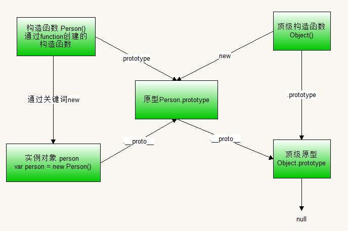

## 原型链与 构造函数，实例，原型的关系图
>原型链: 从对象出发，可以找到它的原型，对象也是一个原型，因此就能够找到原型的原型
>这样依次往复，最后就找到了`Object.prototype`（顶级原型对象如果再往上使用`__proto__`方法就返回一个`null`值）

`.prototype`是构造函数的一个属性，通过他可以找到原型
`.__proto__`是实例对象的一个默认属性
