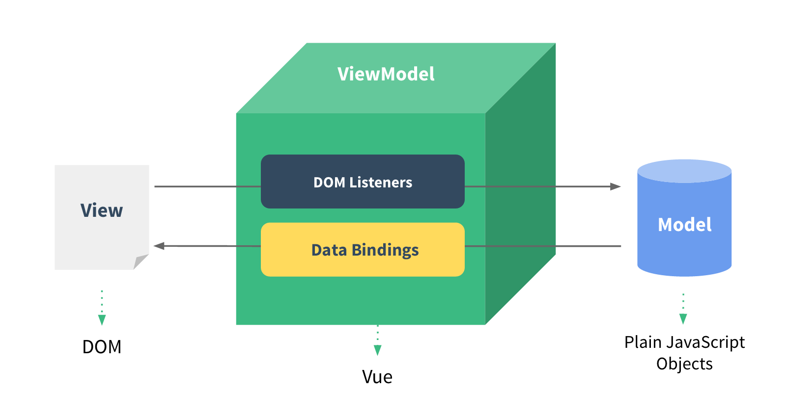

# vue基础知识
## 类库&框架
## Vue简介
Vue.js（读音 /vjuː/, 类似于 view） 
是一套构建用户界面的 渐进式框架。
与其他重量级框架不同的是，Vue 采用自底向上增量开发的设计。
Vue 的核心库只关注视图层，并且非常容易学习，非常容易与其它库或已有项目整合。
另一方面，Vue 完全有能力驱动采用单文件组件和 
Vue 生态系统支持的库开发的复杂单页应用。  
渐进式框架。
1.可以当类库用 使用jquery做dom操作 数据交互
2.使用vue当类库 进行dom操作  jquery数据交互
3.使用vue做全套功能
4.使用vue做组件化等等
[Vue官网](https://cn.vuejs.org/)

## Vue的helloworld
`Vue` 可以直接把它当做一个js库使用，所以它可以很容易的接入到你的项目或者单个页面中。
甚至你可以只使用它的双向绑定功能。
第一步：直接将vue库引入页面
下载vue的js文件
1. 官方提供的cdn地址
<script src="https://unpkg.com/vue/dist/vue.js"></script>
2. npm下载 npm i vue  下载后dist文件夹里面找

第二步：数据绑定
 <div id="app">
    <!--Vue的模板的绑定数据的方法， 类似于很多其他前端的模板，可以用两对花括号进行绑定Vue中的数据对象的属性 -->
    {{ message }}
  </div>
第三步：创建Vue的对象，并把数据绑定到上面创建好的div上去。
  <script>
    var app = new Vue({         // 创建Vue对象。Vue的核心对象。
      el: '#app',               // el属性：把当前Vue对象挂载到 div标签上，#app是id选择器
      data: {                   // data: 是Vue对象中绑定的数据
        message: 'Hello Vue!'   // message 自定义的数据
      }
    });
  </script>
第四步：在浏览器的控制台修改app.message的值
## Vue的Helloworld总结
- Vue构造函数的：选项el属性，就是element缩写，当前Vue对象挂载到哪个标签上的语法，支持CSS选择器或者dom对象，一般用id选择器选择当前页面的标签。
- Vue的选项：data属性是自定义数据。这里我们只是演示了一个message属性，vue会把自定义的数据可以与html的模板数据进行绑定。
- Vue 数据绑定的方式就是用 `{{}}`。
- 上面这个demo就是演示了Vue的绑定数据的基本模型。注意点，标签先创建好了之后，再创建Vue对象。

# Vue数据绑定

## 什么是双向绑定？



## Vue绑定文本
数据绑定最常见的形式就是使用 “Mustache” 语法（双大括号）的文本插值  
创建的Vue对象中的data属性就是用来绑定数据到HTML的。
例如 上面一个例子helloworld `{{}}`

## 绑定数据中使用JavaScript表达式
对于所有的数据绑定， Vue.js 都提供了完全的 JavaScript 表达式支持。
当然Vue还可以支持表达中的任何计算、函数处理等。参考下面的案例。
```html
  <div id="app">
      {{ msg + ' - ' + name }}
    <p>
      {{ isOk ? '123' : '456' }}
    </p>
    <p>我的年龄是： {{ age *2 }}</p>
  </div>
 <script>
  var app = new Vue({         // 创建Vue对象。Vue的核心对象。
    el: '#app',               // el属性：把当前Vue对象挂载到 div标签上，#app是id选择器
    data: {                   // data: 是Vue对象中绑定的数据
      msg: 'Hi',              // message 自定义的数据
      name: 'flydragon',
      isOk: true,
      age: 18
    }
  });
  </script>
```


## Vue属性绑定
Vue中不能直接使用`{{ expression }}` 语法进行绑定html的标签的属性，而是用它特有的v-bind指令（就是一种写法，先按照格式走，具体指令是什么可以后续再了解）。   

绑定的语法结构：
```
<标签 v-bind:属性名="要绑定的Vue对象的data里的属性名"></标签>
例如:
<div v-bind:id="menuId"></div>
```
参考如下代码案例：
```html
  <div id="app">
    <div v-bind:id="foo">
     
    </div>
  </div>
  <script>
    var app = new Vue({         
      el: '#app',               
      data: {                   
        img:"http://cn.vuejs.org/images/logo.png",
        foo: 'barId'
      }
    });
  </script>
```

## 属性绑定简写
由于`v-bind` 使用非常频繁，所以Vue提供了简单的写法，可以去掉v-bind直接使用`:`即可。
```html
例如：
<div :id="MenuContaineId">
等价于
<div v-bind:id="MenuContaineId">
```


## 样式绑定
对于普通的属性的绑定，只能用上面的讲的绑定属性的方式。而Vue专门加强了class和style的属性的绑定。可以有复杂的对象绑定、数组绑定样式和类。
普通样式绑定，就当是字符串去绑定。
```html
 <div id="app">
    <div :style="testCss">
       囧囧
    </div>
  </div>
  <script>
    var foo = new Vue({         
      el: '#app',               
      data: {         
        testCss:'color: red; margin-left: 20px;background-color: #ccc;'
      }
    });
   </script>
```   

###style 绑定内联样式
内联样式的绑定，非常类似于样式类的操作。
v-bind:style 的对象语法十分直观——看着非常像 CSS ，
其实它是一个 JavaScript 对象。
 CSS属性名可以用驼峰式（camelCase）或短横分隔命名（kebab-case）。

1.一个对象传递写法
```html
 <div id="app1">
    <div :style="test">
       囧囧1
    </div>
  </div>
 <script>
    var foo = new Vue({         
      el: '#app1',               
      data: {  
         test:{ 
          'color': 'red',
          'margin-left':'20px',
          'background-color': '#ccc'
         }
      }
    });
  </script>
```
2.对象的属性传递写法
```html
  <div id="app2">
    <div :style="{color:color,'margin-left':left}">
       囧囧2
    </div>
  </div>
  <script>
    var bar = new Vue({         
      el: '#app2',               
      data: {    
          'color': 'red',
          left:'20px'
       }
    });
  </script>
```
3.数组的方式传递多个样式对象
```html
  <div id="app3">
    <div :style="[a,b]">
       囧囧3
    </div>
  </div>
  <script>
   var baz = new Vue({         
      el: '#app3',               
      data: {    
          a:{'color': 'red'},
          b:{'margin-left':'20px'}
       }
    });
  </script>
```
### 绑定样式对象
经常我们需要对样式进行切换，比如：div的显示和隐藏，某些标签active等。Vue提供的对象绑定样式的方式就很容做这些事情。
```html
代码：
<div v-bind:class="{ active: isActive }"></div>
解释：
当 isActive为 true时， div就会具有了active样式类，如果 isActive为false，那么div就去掉active样式类。
```
1.绑定外部样式表 并控制样式表的是否生效
```html
  <style>
  .active {
    background-color: #ccc;
  }
  </style>
  <div id="app">
    <div  v-bind:class="{ active: isActive }">
      绑定颜色类
    </div>
  </div>
  <script>
    var app = new Vue({         
      el: '#app',               
      data: {     
        isActive: true
      }
    });
  </script>
```
2.v-bind:class 指令可以与普通的 class 属性共存
```html
  <style>
  .test{
    color:blue;
  }
  </style>
   <div id="app2">
    <div :class="{test:isOk,'important': isError}">
       囧囧2
    </div>
  </div>
  <script>
      var bar = new Vue({         
      el: '#app2',               
      data: {    
          isOk:true,
          isError:true
       }
    });
  </script>
```
3. ：class数组
```html
  <style>
  .test{
    color:blue;
  }
  .test2{
    background-color:aquamarine;
  }
  </style>
   <div id="app3">
    <div :class="[a,b]">
       囧囧3
    </div>
  </div>
  <script>
     var baz = new Vue({         
      el: '#app3',               
      data: {    
          a:'test',
          b:'test2'
       }
    });
  </script>
```
当然还有很多其他很有趣的支持，就不赘述了。
```html
例如:
<div v-bind:class="[isActive ? activeClass : '', errorClass]">
<div v-bind:class="[{ active: isActive }, errorClass]">
```
## 输出纯HTML
由于Vue对于输出绑定的内容做了提前encode，保障在绑定到页面上显示的时候不至于被xss攻击。但某些场景下，我们确保后台数据是安全的，那么我们就要在网页中显示原生的HTML标签。Vue提供了`v-html`指令。
```html
<div id="app">
  <div  v-html="html">
  </div>
</div>
<script>
  var app = new Vue({         
    el: '#app',               
    data: {                   
      html: '<p>内容</p>'
    }
  });
</script>
```


## 双向数据绑定

上面的例子我们大多讲的是单向的 js对象向 HTML数据进行绑定，那HTML怎样向js进行反馈数据呢？
HTML中只有表达能接受用户的输入，最简单的演示双向绑定的就是文本框了。

Vue提供了一个新的指令：v-model进行双向数据的绑定，注意不是v-bind。
```html
  <div id="app">
    <!-- v-model可以直接指向data中的属性，双向绑定就建立了 -->
    <input type="text" name="txt" v-model="msg">
    <p>您输入的信息是：{{ msg }}</p>
  </div>
  <script>
    var app = new Vue({         
      el: '#app',               
      data: {                   
        msg: '双向数据绑定的例子'
      }
    });
  </script>
```
修饰符
.lazy 把监听keyup事件变成change事件，写法是在指令名字后面加.lazy
<input v-model.lazy="msg" >
.trim 自动过滤用户输入的首尾空格
<input v-model.trim="msg">
注意点：修饰符支持链式  v-model.trim.lazy
## 计算属性
在做数据的绑定的时候,数据要进行处理之后才能展示到html页面上，虽然vue提供了非常好的表达式绑定的方法，但是只能应对低强度的需求。比如： 把一个日期按照规定格式进行输出，可能就需要我们对日期对象做一些格式化的出来，表达式可能就捉襟见肘了。

Vue对象提供的computed属性，可以让我们开发者在里面可以放置一些方法，协助我们绑定数据操作，这些方法可以跟data中的属性一样用，注意这些方法用的时候不要加`()`。
例子来了：
```html
  <div id="app">
        <!-- computed里面的函数可以直接当成data里面的属性用，非常方便，注意没有括号！！！-->
        <div>生日:{{ getBirthday }}</div>
  </div>
  <script>
    var app = new Vue({         
      el: '#app',               
      data: {                   
        birthday: 914228510514,     // 这是一个日期对象的值：1998年11月1日 1970
        size:'s、m、l、xl、xxl'     s/m/l/xl/xxl
      },
      computed: {
        // 把日期换成 常见规格格式的字符串。
        getBirthday: function () {
          var m = new Date(this.birthday);
          return m.getFullYear() + '年' + (m.getMonth()+1) +'月'+ m.getDate()+'日';
        }
      }
    });
  </script>
```
注意点：这里getBirthday的值是跟着birthday变化的，也就是修改app.birthday会改变页面上getBirthday的值
，如果getBirthday多次被访问，则是从缓存中获取的值，也就是说app.birthday值不变，getBirthday只会被计算一次。
如果需要每次都被重新计算，例如，实时获取当前的时间，写法如下
```
methods:  {
  now: function () {
    return Date.now();
  }
  }

```
使用methods属性替代computed即可。
## 数据绑定总结

vue提供了大量的绑定的语法和方法，非常方便我们进行数据的绑定，尤其它是双向的数据绑定，极大的减少了我们dom操作的麻烦程度。


## 条件渲染

有时候我们要根据数据的情况，决定标签是否进行显示或者有其他动作。最常见的就是，表格渲染的时候，如果表格没有数据，就显示无数据。如果有数据就显示表格数据。
Vue帮我们提供了一个`v-if`的指令，帮助我们完成判断的模板处理。

```html
<div id="app">
  <h1 v-if="ok">Yes</h1>
  <h1 v-else>No</h1>  
</div>
<!-- 当ok为true的时候，输出： Yes， 否则输出： No -->

<script>
  var app = new Vue({         
    el: '#app',               
    data: {    
      ok: false      // true,返回：Yes，   false=> No               
    }
  });
</script>
```
v-show
```html
 <div id="app2">
  <h1 v-show="ok">Yes</h1>
</div>
<script>
   var app2 = new Vue({         
    el: '#app2',               
    data: {    
      ok: false      // true,返回：Yes，   false=> No               
    }
  });
  </script>
```

## 列表渲染

### 基本v-for循环渲染标签
模板引擎都会提供循环的支持。Vue也不例外，Vue是提供了一个`v-for`指令。基本的用法类似于foreach的用法。还是看例子最直接，上代码：

1.第一种写法
```html
  <ul id="example-1">
    <li v-for="item in items">
      {{ item.message }}
    </li>
  </ul>
<script>
 var example1 = new Vue({
  el: '#example-1',
  data: {
    items: [
      {message: 'Foo' },
      {message: 'Bar' }
    ]
  }
})
</script>
```
2.第二种写法 
```html
<ul id="example-2">
  <li v-for="(item, index) in items">
    {{ parentMessage }} - {{ index }} - {{ item.message }}
  </li>
</ul>
<script>
 var example2 = new Vue({
  el: '#example-2',
  data: {
    parentMessage: 'Parent',
    items: [
      { message: 'Foo' },
      { message: 'Bar' }
    ]
  }
})
</script>
```

### Template循环渲染多标签
上面的例子，我们演示的是 每次循环输出一个tr标签。如果我们希望每次循环生成两个tr标签呢？如果还有生成其他的标签呢？

Vue给我们提供了template标签，供我们用于v-for循环中进行处理。

上代码喽：
```html
<ul>
  <!-- 通过template标签，可以一次循环，输出两个li标签 -->
  <template v-for="item in items">
    <li>{{ item.msg }}</li>
    <li class="divider"></li>
  </template>
</ul>
```

### 关于v-for对应的数组的更新
由于Vue的机制就是检测数据的变化，自动跟新HTML。数组的变化，Vue之检测部分函数，检测的函数执行时才会触发视图更新。这些方法如下：

## 表格显示的综合小案例
下面是一个综合的案例，每秒钟往表格中添加一条数据。
本案例综合使用了v-if 和 v-for循环综合案例。
<body>
  <div id="app">
    <table>
      <thead>
        <tr>
          <th>姓名</th>
          <th>年龄</th>
          <th>地址</th>
        </tr>
      </thead>
      <!-- 如果列表有数据，直接输出表格数据，没有数据提示用户没有数据 -->
      <tbody v-if="UserList.length > 0"> 
        <tr v-for="item in UserList" >
          <td>{{ item.name }}</td>
          <td>{{ item.age }}</td>
          <td>{{ item.address }}</td>
        </tr>
      </tbody>
      <tbody v-else>
        <tr><td colspan="3">没有数据奥！</td></tr>
      </tbody>
    </table>
  </div>
  <script>
    var app = new Vue({         
      el: '#app',               
      data: {                   
       UserList: []
      }
    });

    // 每秒钟插入一条数据。
    setInterval(function () {
      app.UserList.push({'name': 'zyc', 'age': 81, 'address': 'beijing'});
    }, 1000);
  </script>
```

## 总结列表和条件绑定
列表的使用其实本质还是js的衍生使用，对于有js开发基础的没有什么难度。关键是多写几个案例就会详细通了。
## Vue事件处理

### 监听事件的Vue处理
Vue提供了协助我们为标签绑定时间的方法，当然我们可以直接用dom原生的方式去绑定事件。Vue提供的指令进行绑定也是非常方便，而且能让ViewModel更简洁，逻辑更彻底。所以还是推荐大家使用的。

Vue提供了`v-on`指令帮助我们进行事件的绑定。
基本的内联事件处理方法[官方demo]：   

```html
<div id="example-1">
  <!-- 为按钮绑定点击事件，执行counter += 1的任务。 -->
  <button v-on:click="counter += 1">增加 1</button>
  <p>这个按钮被点击了 {{ counter }} 次。</p>
</div>
<script>
var example1 = new Vue({
  el: '#example-1',
  data: {
    counter: 0
  }
})
</script>
```

## 事件处理方法集成到Vue对象
内联的方式绑定的事件，只能处理简单的事件的处理逻辑。复杂的情况还是封装到js中最方便，也不容易出错。
Vue对象中可以添加methods属性，开发者可以把事件处理函数的逻辑放到methods中。

```html
<!DOCTYPE html> 
<html lang="en">
<head>
  <meta charset="UTF-8">
  <title>Vue入门之动态显示表格</title>
  <script src="https://unpkg.com/vue/dist/vue.js"></script>
</head>
<body>
  <div id="app">
    <p>{{ number }}</p>
    <input type="button" name="btnGetNumber" value="增加[绑定事件处理器]" v-on:click="getNumber">
    <input type="button" name="btnGetNumber" value="增加[内联方法调用]" v-on:click="getNumber()">
  </div>
  <script>
    var app = new Vue({         
      el: '#app',               
      data: {                   
        number: 1
      },
      methods: {
        // 事件响应方法的逻辑代码
        getNumber: function (e) {
          this.number += 1;   // 不管是内联方法调用，还是绑定事件处理器两种方式执行事件响应方法的时候 this都是指向 app
        }
      }
    });
  </script>
</body>
</html>
```


## 按键修饰符
在监听键盘事件时，我们经常需要监测常见的键值。 Vue 允许为 v-on 在监听键盘事件时添加按键修饰符：
```html
<!-- 只有在 keyCode 是 13 时调用 vm.submit() -->
<input v-on:keyup.13="submit">
记住所有的 keyCode 比较困难，所以 Vue 为最常用的按键提供了别名：
<!-- 同上 -->
<input v-on:keyup.enter="submit">
<!-- 缩写语法 -->
<input @keyup.enter="submit">
```

全部的按键别名：

- .enter
- .tab
- .delete (捕获 “删除” 和 “退格” 键)
- .esc
- .space
- .up
- .down
- .left
- .right
- .ctrl
- .alt
- .shift
- .meta

## 事件绑定的简写
Vue中属性的绑定的简写直接是`:` === 'v-bind:'   
而事件的缩写是直接变成`@`.  也就是说：  `v-on:` === `@`
看下面的例子：
```html
<!-- 完整语法 -->
<a v-on:click="doSomething"></a>
<!-- 缩写 -->
<a @click="doSomething"></a>
```

## 事件绑定总结

Vue为了方便大家进行开发，提供了事件的相关的封装，可以让我们方便我们用Vue对事件进行开发，尤其是v-on指令的非常方便的跟Vue对象中methods进行配合进行复杂的事件处理，非常方便。另外事件的事件修饰符和按键修饰符也可以让Vue事件这块锦上添花。
